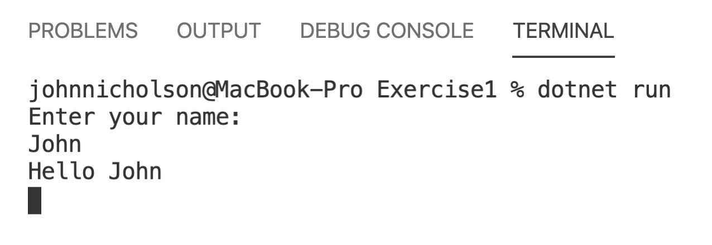

# Lesson 1 Lab:

## Pre-requisites

- [Visual Studio Code](https://aka.ms/win32-x64-user-stable)

- [Dotnet 5.0](https://download.visualstudio.microsoft.com/download/pr/fc1e9923-c4ea-41eb-bddb-165b684fdd4d/cdc2508795eef111e2feb35625e2e460/dotnet-sdk-5.0.100-rc.1.20452.10-win-x64.exe)

## Exercise 1: First Console Application
### 1.1: Create the app

Create a .NET Core console app project named "HelloWorld".

1. Start Visual Studio Code.

1. On the start page, choose **Open Folder**.

1. On the **Open Folder** dialogue, browse to `c:\code\mtadev\lesson1\Exercise1` then choose **Open**.

   > :ok_hand:
   > If you don't see the files please ensure you have downloaded the pre-requisites to `c:\code\mtadev`.

1. In the **EXPLORER** panel on the left, select `Program.cs`.

   

Enter the following into the file:

```csharp
using System;

Console.WriteLine("Hello World!");
```

### 1.2: Run the app
There are 2 ways to achieve this:

- Visual Studio Code
    1. Press <kbd>Ctrl</kbd>+<kbd>F5</kbd> to run the program without debugging.
> You may be shown a prompt stating that the coreclr debugger is not enabled if this is the case please install the c# extension as per the [prerequisites](./Lesson0_PreRequisites.md)
- Command Line
    1. Start the terminal/ console tab
    1. In the terminal type : `dotnet run`
    
        The console window opens with the text "Hello World!" printed on the screen and some Visual Studio debug information.
        

### 1.3: Enhance the app

Enhance the application to prompt the user for their name and display it.

1. In *Program.cs*, replace the contents of the file with with the following code:

   ``` csharp
    using System;
   
    Console.WriteLine("Enter your name: ");
    var userName = Console.ReadLine();
    Console.WriteLine($"Hello {userName}");
    Console.ReadKey();
   ```

   

1. Start the terminal/ console tab
1. In the terminal type : `dotnet run`

1. Respond to the prompt by entering a name and pressing the <kbd>Enter</kbd> key.

   

1. Press any key to stop application.

## Exercise 2 - Debugging an application
1. Open Folder `Lesson1/Exercise2` in VSCode
1. Open `Program.cs`.
1. Click to the left of line 5 to set a breakpoint

   

1. Press <kbd>F5</kbd> to run the program **with** debugging.

1. Open the Terminal and enter a name and press <kbd>Enter</kbd> to respond to the prompt.
   
   The breakpoint will now fire and allow the current state of the application to be examined.

1. Move the mouse over `userName`
   The value stored in that variable should now be displayed. 
   

1. Select the entry point in `Debug Console`, 
   type `userName` and press <kbd>Enter</kbd>
   

## Exercise 3 - Variables and Operators
1. Open Folder `Lesson1/Exercise3` in VSCode
1. Open `Program.cs`
> We are going to perform some simple arithmetic operations
> When you examine `Line 8` you'll see a very simple example of addition.
3. Press <kbd>F5</kbd> to run the program **with** debugging.
> In the terminal we can see the outpu that this code has created as you can see it isn't what we would expect.
> ``` 
> B is: 2
> C is: 3
> D = c / b
> D is: 1
> D is a Int32
> ```
> 
> The final output is telling us what type the variable d is in this case a 32 bit integer.
>
> Let's fix this so we see the correct figure 
4. Update `Line 10` to be as follows:
   ``` csharp
   decimal c = 1+2;
   ```
5. Press <kbd>F5</kbd> to run the program **with** debugging.
> The displayed output should now show the expected output

6. Add the following code into `Line 20`

   ``` csharp
   d++;
   var e = ++d;
   e--;
   var f = --e;
   ```
   Make a guess at what the output will before we run the code.
> Increment Operators can be added as a postix or a prefix, this changes the when the increment occurs, either before assignment or after assignment. For Example:
> ``` csharp
>  var a = 1
>  var b = a++; // the assignment happened before increment so b will be 1;
>  var c = ++a; // the assignment happened after increment so c will be 3;
> ```
7. Press <kbd>F5</kbd> to run the program **with** debugging.

## Exercise 4 - Error Handling

1. Open Folder `Lesson1/Exercise4` in VSCode
1. Open `Program.cs`
1. Press <kbd>F5</kbd> to run the program **with** debugging.
   Look at the `Error` that is displayed
   
### Handle The Error
4. Add the following below `Line 6`
   ``` csharp
   try 
   {
   ```
1. Add the following below `Line 12`
   ``` csharp
   } 
   catch (Exception ex)
   {
      Console.WriteLine($"Exception: {ex.Message}");
   }
   ```
1. Press <kbd>F5</kbd> to run the program **with** debugging.
> Note the Message that is output. `Exception` is the most generic exception type.
> This means that any possible error that occurs here will be caught and handled in the same way.
7. Add the following below `Line 10`
   ``` csharp
   } 
   catch (FileNotFoundException fnfe)
   {
      Console.WriteLine($"File Not Found: {fnfe.Message}");
   }
   ```
> If we want to be more specific we need to make the exception we are catching more specific. The same try/catch block can handle mulple exceptions in different ways.
8. Press <kbd>F5</kbd> to run the program **with** debugging.
   Note the Message that is output. `FileNotFoundException` is a specific exception type.
### Closing the connection
9. Add the following code below 'Line 13`
   ``` csharp
   finally
   {
      Console.WriteLine("Always execute");
   }
   ```
> It is always good to get rid of connections to external resources(databases, files on disk, etc) when are a not using them. A finally block always execute
